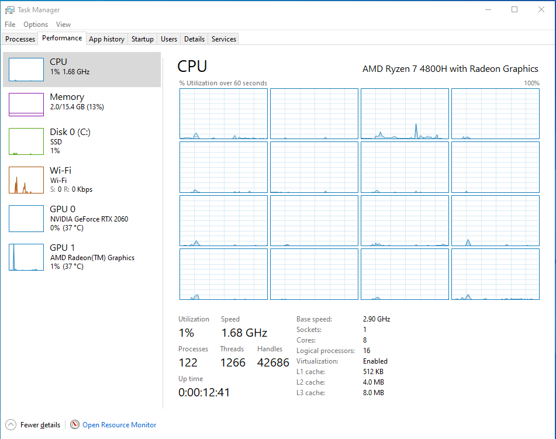
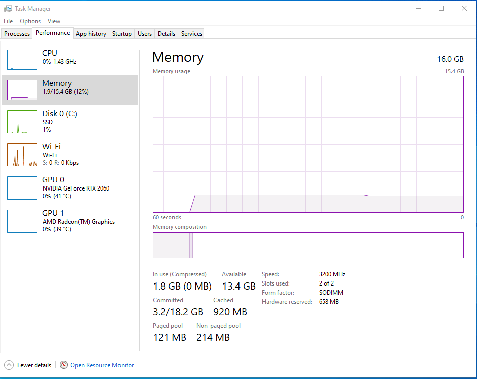
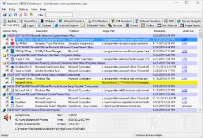
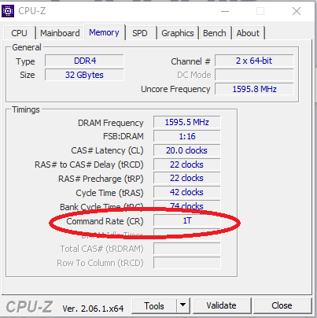
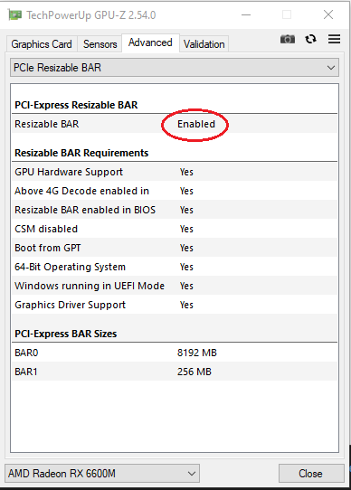
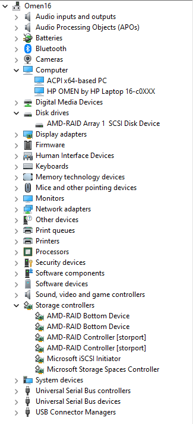
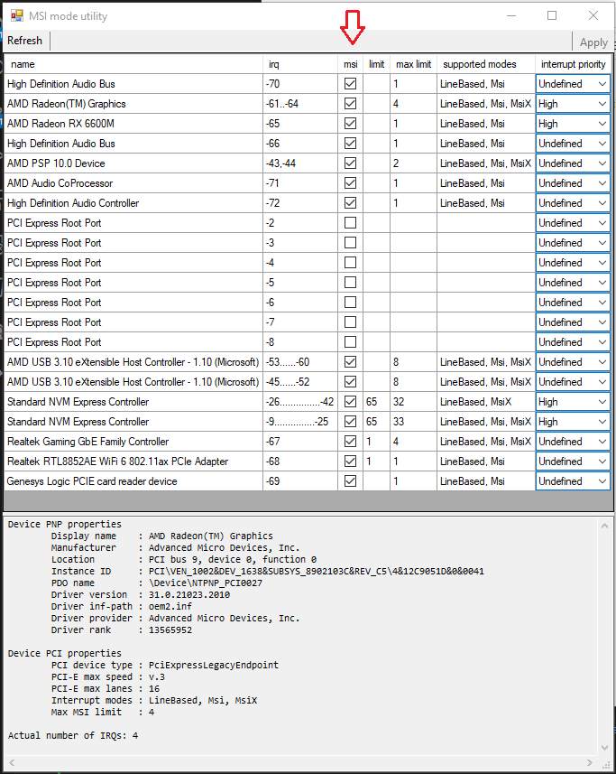
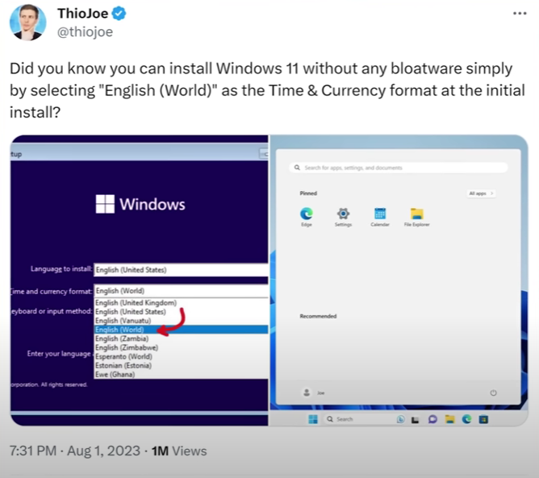

# FACET4 WINDOWS 10/11

  - [**Description**](#description)
  - [**Before you run!**](#before-you-run)
  - [**Liability**](#liability)
  - [**Execution**](#execution)
  - [**Interactivity**](#interactivity)
  - [**Compatibility**](#compatibility)
  - [**Known side effects**](#known-side-effects)
  - [**Known issues**](#known-issues)
  - [**Undo changes**](#undo-changes)
  - [**Final considerations**](#final-considerations)
  - [**Thanks To**](#thanks-to)


## **Description**


#### "The Year 2024: Yet another script to 'optimize,' reduce latency, and debloat Windows by butchering your OS with thousands of registry tweaks—backed by absolutely zero solid evidence (like ANOVA hypothesis test) to prove you're somehow smarter than the actual developers who built the system."

#### *"Am I a genius? Nope. Am I clueless? Also nope. I just spend an unreasonable amount of time painstakingly testing every single function in this project. So yeah, it's not magic—it's obsession."*

---

Introduction:

The PowerShell script presented here automates routine tasks on Windows 10 and 11 distributions (24H2 compatible), specifically focusing on improving performance and reducing overall latency for devices with limited CPU and RAM resources. While the script does not target IT administrators or serve as an ``"anti-tracking"`` solution, it aims to balance maintaining desired functionality and optimising system performance.

Approach and Scope:

Unlike conventional ``"debloatware"`` scripts available on the web, this comprehensive script encompasses various elements beyond removing unnecessary features. Acknowledging that such deletions can lighten the system, my approach combines different methodologies and best practices to explore specific areas that warrant further optimisation.

It is crucial to recognise the complexity and quality of the operating system developed by Microsoft and its collaborators. Attempting further optimisation without compromising essential functionality would be audacious. Therefore, my script identifies areas where functionality can be optimised to gain performance while retaining the system's overall characteristics and ensuring broad compatibility.

Respecting Official Distributions:

My philosophy does not endorse creating a barebones and featureless system through code. Suspicious distributions like ``"ATLAS"`` or ``"TINY 11"`` are not recommended, despite acknowledging the developers' efforts. Instead, I emphasise relying on official distributions designed to meet most users' requirements.

Challenges and Best Practices:

While tools like ``"NTlite"`` can help test scripts for optimisation purposes, I must approach this task with the utmost respect for the system's developers and a deep understanding of its nuances. Disabling features or altering kernel behaviour without comprehensive knowledge can lead to adverse effects. Thoroughly filtering through official documentation, addressing misconceptions, and distinguishing signal from noise can be time-consuming, yet essential.

Windows Services Optimisation:

Based on my experience, extensive optimisation of Windows Services proved to be a fruitless endeavour. Accepting the system as it is maybe the wiser choice for most scenarios. However, individuals seeking further customisation may explore options involving low-level programming languages and kernel customisations.

#### Fresh installation of Windows LTSC 21H2 with all drivers and updates installed after applying this script :


CPU:




Memory:




## **Before you run!**

```
☝ Although the author has made an effort to provide broad compatibility,
    this script was conceived aiming at a clean install of Windows,
    and if you use it outside that context, some programs may stop working.
    Be aware of the risk.
```

```
🚫 Do not run this script if you are not familiar with the topic.
    Some functions may reduce security, uninstall or prevent applications from running again and disable
    some internal operating system functionalities. If you don't understand what a function does, don't run it.
```

```
🚫 Never run scripts from strangers without checking the code first!
    Research indicates that a significant 76% of ransomware attacks originate from PowerShell scripts.
```

```
🚫 This script can damage your operating system by forcing a complete reinstallation.
    It is at your discretion and risk.
```


## **Liability**

This script has taken dozens of hours and years of experimentation on my part, self-learning, and is being shared freely for use, distribution, and study. I'm not responsible for anything. All script is provided as it is, and you can use it at your own risk.


## **Execution**

The script is divided into a module with all the functions and a preset file containing only the call of the procedures to be executed. Directly running the script.cmd file solves all these complexities for you, such as elevating privileges.

If you just want to run the script with the default preset, `download and unpack it` and then simply double-click on the script.cmd file and confirm the User Account Control prompt.


## **Interactivity**

This script is designed to run without any user interaction. Modify it as you like.

### Presets

The preset file is a simple list of function names which should be called. Any function which is not present or commented in a preset will not be called. Thus the corresponding function will not be applied.

The function name can be prefixed with an exclamation mark `!`, which will instead cause the function to be removed from the selection. This is useful when you want to apply the whole preset but omit a few specific functions in the current run.

### Log

The script automatically stores the output of the script execution in a folder like `C:\Temp\facet4` .

### System Restore Point

The script automatically tries to create a system restore point before the functions run.

System Restore is a feature designed to create a snapshot of the current working state and save it as a "restore point" when essential changes are detected on your computer. Suppose a critical issue occurs after installing an update, driver, or application or incorrectly modifying system settings in the registry, you can use a restore point to revert your laptop or desktop computer to an earlier state to resolve the issue without losing your files.


## **Compatibility**

The script was developed and tested using the latest Windows 10 and 11 Home and Pro distributions in English and Portuguese languages and aims to be fully compatible with the most up-to-date version of them, you can run the script on other distributions, but the code is still designed primarily for Home/Pro and is not compatible with versions before Windows 10.

- [x]  Windows 10 (English/Portuguese)
    - [x]  Home
    - [x]  Pro
- [x]  Windows 11 (English/Portuguese)
    - [x]  Home
    - [x]  Pro


## **Known side effects**

- Some Windows settings will show the message `Some of these settings are hidden or managed by your organization.` This is due to some functions of the script that use Group Policy Objects (GPO).
The exact mechanism is used in companies so that users without administrative privileges cannot change the settings. I'm using this because, in theory, it prevents future system updates from reverting these settings without notice. 
If you would like to make these settings available, disable the `DisableAppCompat` function in the present file before running it.
- The script disables support for legacy 16-bit applications. 
If you still use any apps from the Jurassic period, disable the `DisableAppCompat` function in the present file before running it.
- The script disables some functionality of the `Xbox` subsystem. 
If you use any games from your Xbox account, disable the `RemoveXboxFeatures` function in the present file before running.
- This script automatically changes the `Processor performance boost mode` plan according to the processor brand (AMD/Intel) and computer type (Notebook/Desktop). 

You can easily change this option by accessing the steps below:
1. Open Command Prompt: `hold down the Windows Key, and Press R` on your keyboard.
2. Type `power` in the window and press Enter.
3. Click on the `Change advanced power settings` option and scroll down to the `Processor power management` tab. The default state is `Aggressive` .
4. Follow the on-screen options to change and click on the `Apply` button. It is not necessary to restart the device.
        

        

## **Known issues**

When trying to change a specific key when using an Azure Active Directory account.

The problem is easily worked around by performing this modification manually using `Regedit`.


## **Undo changes**

### Reverse the entire script

Based on my "limited" knowledge acquired over the years as a user, I do not believe that reversing function by function will bring your operating system to the previous state with the same behaviour in all its details. 
I have always witnessed several inconsistencies using this approach in addition to spending many hours trying to solve this.

Based on the above, I find it advisable (which is why this built-in tool exists in Windows) to perform a **System Restore Point** before executing this script.

To revert the entire script, follow these steps:

1. Open Command Prompt `hold down the Windows Key, and Press R` on your keyboard.
2. Type `rstrui.exe` in the window, and then press Enter.
3. Find a restore point with a name like `System Restore Point dated 00/00/0000 00:00:00 before running facet4 script`. It should be the newest restore point there.
4. Follow the on-screen instructions to complete the system restore.

### Revert functions

To undo the effects of a specific function, you can write and add a complementary function that restores the original behavior and append it to the current file.

The code at the end of each instruction contains the default values for Windows 11 22H2 and Windows 10 LTSC 21H2 distributions.

You are welcome to experiment and modify the functions as you wish.

## **Final considerations**

If you understand what you are doing, consider downloading and running Microsoft Autoruns to check your system.

This utility, which has the most comprehensive knowledge of auto-starting locations of any startup monitor, shows you what programs are configured to run during system bootup or login, and when you start various built-in Windows applications like Internet Explorer, Explorer and media players. These programs and drivers include ones in your startup folder, Run, RunOnce, and other Registry keys. Autoruns reports Explorer shell extensions, toolbars, browser helper objects, Winlogon notifications, auto-start services, and much more. Autoruns goes way beyond other autostart utilities.

https://learn.microsoft.com/en-us/sysinternals/downloads/autoruns




#### After executing this script, I recommend the following steps to achieve an optimized experience. It's advisable to conduct thorough research before implementing any changes, and please be aware that any alterations are at your own risk. The author cannot be held accountable for any issues or damages that may arise.

#### 1.Adjust Memory Command Rate: Explore the BIOS settings for your memory and locate the "Command Rate" or similar settings such as "Nmode." Change the value from 2T to 1T. This adjustment can lead to a perceptible improved performance.




#### 2.Modify "DDR Power Down Mode": Within the BIOS, find settings like "DDR PowerDown and idle counter" related to power management. Switch from "Auto" or "Enabled/BIOS" to "Disabled/PCODE." This change can contribute to better system responsiveness. Reduces, in most cases, ~8% of memory latency.

#### 3.Enhance GPU Performance: If using a first-rate video card, investigate whether it supports "Above 4G Decoding" or "Resizable BAR." If compatible, research the process to enable this feature on your motherboard. It enhances graphics performance a lot.




#### 4.Explore RAID Configuration: For users with an AMD Ryzen platform, it's worth exploring the possibility of utilizing RAID 0 for SATA or NVMe devices. Even notebooks with locked BIOS and two NVMe ports might support this `unofficially`. Search how to implement this configuration for improved storage performance. It's pure luxury, but it is fantastic!




#### 5.Enable Message Signaled Interrupts. Be aware that enabling MSI for a driver without support will break your Windows!




#### 6.And lastly, don't forget, if it's a fresh install of the operating system, select "English (World)" as the time zone; it pretty much solves the initial bloatware problem on your new Windows. This does not apply to the LTSC or IoT distros, as it already comes with reduced OS footprint. Credits to mastermind @ThioJoe!




#### Following these guidelines can significantly optimize your system's performance after running this script. Remember to conduct in-depth research and understand the potential implications of each modification before proceeding. Your own discretion and caution are advised, as the author takes no responsibility for any adverse outcomes.

## **Thanks To**

The thousands of people who actively contribute to forums, websites and communities, making their knowledge available; without this, it would not be possible to waste/spend dozens of hours trying to learn things like this. 

I leave my thanks.
