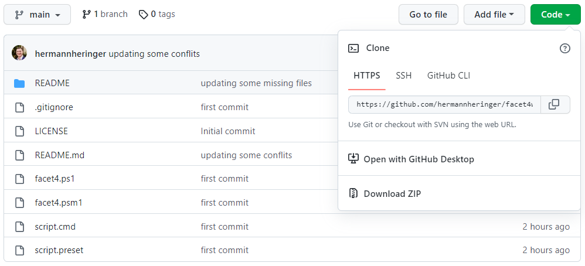
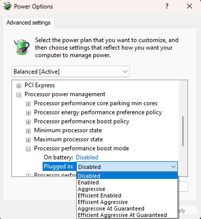

# FACET4 WINDOWS 10/11

  - [**Description**](#description)
  - [**Before you run!**](#before-you-run)
  - [**Liability**](#liability)
  - [****Execution****](#execution)
  - [**Interactivity**](#interactivity)
  - [**Compatibility**](#compatibility)
  - [**Known side effects**](#known-side-effects)
  - [**Known issues**](#known-issues)
  - [**Undo changes**](#undo-changes)
  - [**Thanks To**](#thanks-to)


## **Description**


Firstly, this is a PowerShell script for automating routine tasks that I use on my computers and made for Windows 10 and 11 distributions to make it lighter and perform better while retaining as much of the desired functionality as possible on computers and notebooks with weak CPU and low RAM.

This is by no means an `anti-tracking` script, a script for IT administrators -these are on another level of complexity, or a script aimed at general automation that you might as well perform in the GUI - your finger won't fall off doing this, nor are `debloatware` scripts like thousands available on the web and although we emphasize the latter, as it contributes a lot to the overall lightness of the system, this script is a mix of everything above and good practices aiming only at a part that in the author's assessment deserves to be better explored.

It would be very daring on my part, given the simplicity of the script, that we could further optimize a system of this size and quality supported by thousands of intelligent minds around the globe by Microsoft and its collaborators without a significant loss of OS functionality, so we always have to reflect at what point we can give up functionality at the expense of gaining in performance while trying to maintain the general characteristics and broad compatibility of the system. It's not a matter of leaving the system as a barebone "featureless" because I don't believe in this strategy via code. It has no purpose for most users, even because specific distributions are designed for these requirements.


## **Before you run!**

```
☝ Although the author has made an effort to provide broad compatibility,
    this script was conceived with the idea of a clean install of Windows,
    and if you use it outside of that context, some programs may stop working.
    Be aware of the risk.
```

```
🚫 Do not run this script if you are not familiar with the topic.
    Some functions may reduce security, uninstall or prevent applications from running again and disable
    some internal operating system functionality. If you can't understand what a function does, don't run it.
```

```
🚫 Never run scripts from strangers without first checking the code!
```

```
🚫 This script can damage your operating system by forcing a complete reinstallation.
    It is at your discretion and risk.
```


## **Liability**

This script took dozens of hours and years of experimentation on my part, self-learning, and is being shared freely for use, distribution, and study. I'm not responsible for anything. All script is provided as is, and you use them at your own risk.


## ****Execution****

The script is divided into a module with all the functions and a preset file containing only the call of the procedures to be executed. By directly running the script.cmd file solves all these complexities for you, such as elevating privileges.

If you just want to run the script with the default preset, `download and unpack` and then simply double-click on the script.cmd file and confirm the User Account Control prompt.




## **Interactivity**

This script is designed to run without any user interaction. Modify them to your liking.

### Presets

The preset file is a simple list of function names which should be called. Any function which is not present or is commented in a preset will not be called. Thus the corresponding function will not be applied.

The function name can be prefixed with an exclamation mark `!` which will instead cause the function to be removed from the selection. This is useful when you want to apply the whole preset but omit a few specific functions in the current run.

### Log

The script automatically stores the output of the script execution in a folder like `C:\Temp\facet4` .

### System Restore Point

The script automatically tries to create a system restore point before the functions run.

System Restore is a feature designed to create a snapshot of the current working state and save it as a "restore point" when essential changes are detected on your computer. Suppose a critical issue occurs after installing an update, driver, or application or incorrectly modifying system settings in the registry. In that case, you can use a restore point to revert your laptop or desktop computer to an earlier state to resolve the issue without losing your files.


## **Compatibility**

The script was developed and tested using the latest Windows 10 and 11 Home and Pro distributions in English and Portuguese languages and aims to be fully compatible with the most up-to-date version of them, you can run the script on other distributions, but the code is still designed primarily for Home/Pro and is not compatible with versions before Windows 10.

- [x]  Windows 10 (English/Portuguese)
    - [x]  Home
    - [x]  Pro
- [x]  Windows 11 (English/Portuguese)
    - [x]  Home
    - [x]  Pro


## **Known side effects**

- Some Windows settings will show the message, `Some of these settings are hidden or managed by your organization.` This is due to some functions of the script that uses Group Policy Objects (GPO).
The exact mechanism is used in companies so that users without administrative privileges cannot change the settings. I'm using this because, in theory, it prevents future system updates from reverting these settings without notice. 
If you would like to make these settings available, disable the `DisableAppCompat` function in the present file.
- The script disables support for legacy 16-bit applications. 
If you still use any apps from the Jurassic period, disable the `DisableAppCompat` function in the present file before running.
- The script disables some functionality of the `Xbox` subsystem. 
If you use any games from your Xbox account, disable the `RemoveXboxFeatures` function in the present file before running.
- This script automatically changes the `Processor performance boost mode` plan according to the processor brand (AMD/Intel) and computer type (Notebook/Desktop). 

You can easily change this option by accessing the steps below:
1. Open Command Prompt: `hold down the Windows Key, and Press R` on your keyboard.
2. Type `power` in the window and press Enter.
3. Click on the `Change advanced power settings` option and scroll down to the `Processor power management` tab. The default state is `Aggressive` .
4. Follow the on-screen options to change and click the Ok button. It is not necessary to restart the device.
        

        

## **Known issues**

When trying to change a specific key when using an Azure Active Directory account.

The problem is easily worked around by performing this modification manually using Regedit.


## **Undo changes**

### Reverse the entire script

Based on my "limited" knowledge over the years as a user, I do not believe that reversing function by function will bring your operating system to the previous state with the same behaviour in all its details. 
I have always witnessed several inconsistencies using this approach, in addition, to spend many hours trying to solve this.

Based on the above, I found it more recommended (which is why this built-in tool exists in windows) to perform a **System Restore Point** before executing this script.

To revert the entire script, follow these steps:

1. Open Command Prompt `hold down the Windows Key, and Press R` on your keyboard.
2. Type `rstrui.exe` in the window, and then press Enter.
3. Find restore point with a name like `System Restore Point dated 00/00/0000 00:00:00 before running facet4 script`. It should be the newest restore point on there.
4. Follow the on-screen instructions to complete the system restore.

### Revert functions

If you want to revert some specific function, create and add this opposite (or equivalent) name function that reverts the required behaviour to the default and append it to the present file of your folder.


## **Thanks To**

The thousands of people who actively contribute to forums, websites and communities make their knowledge available; without it, it would not be possible to waste dozens of hours trying to learn things like this project. 

I leave my thanks.